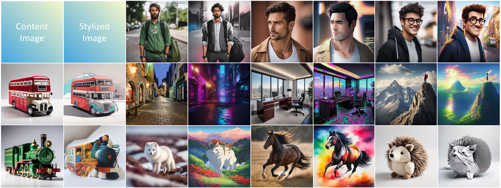

<div id="top"></div>
<!--
*** Thanks for checking out the Best-README-Template. If you have a suggestion
*** that would make this better, please fork the repo and create a pull request
*** or simply open an issue with the tag "enhancement".
*** Don't forget to give the project a star!
*** Thanks again! Now go create something AMAZING! :D
-->


<!-- PROJECT SHIELDS -->
<!--
*** I'm using markdown "reference style" links for readability.
*** Reference links are enclosed in brackets [ ] instead of parentheses ( ).
*** See the bottom of this document for the declaration of the reference variables
*** for contributors-url, forks-url, etc. This is an optional, concise syntax you may use.
*** https://www.markdownguide.org/basic-syntax/#reference-style-links
-->
<!-- [![Contributors][contributors-shield]][contributors-url]
[![Forks][forks-shield]][forks-url]
[![Stargazers][stars-shield]][stars-url]
[![Issues][issues-shield]][issues-url]
[![MIT License][license-shield]][license-url]
[![LinkedIn][linkedin-shield]][linkedin-url] -->


<!-- PROJECT LOGO -->
<br />
<!-- <div align="center">
  <a href="https://github.com/othneildrew/Best-README-Template">
    
  </a>

  <h3 align="center">Best-README-Template</h3>

  <p align="center">
    An awesome README template to jumpstart your projects!
    <br />
    <a href="https://github.com/othneildrew/Best-README-Template"><strong>Explore the docs »</strong></a>
    <br />
    <br />
    <a href="https://github.com/othneildrew/Best-README-Template">View Demo</a>
    ·
    <a href="https://github.com/othneildrew/Best-README-Template/issues">Report Bug</a>
    ·
    <a href="https://github.com/othneildrew/Best-README-Template/issues">Request Feature</a>
  </p>
</div> -->


<!-- TABLE OF CONTENTS -->
<!-- <details>
  <summary>Table of Contents</summary>
  <ol>
    <li>
      <a href="#about-the-project">CAST</a>
      <ul>
        <li><a href="#built-with">Built With</a></li>
      </ul>
    </li>
    <li>
      <a href="#getting-started">Getting Started</a>
      <ul>
        <li><a href="#prerequisites">Prerequisites</a></li>
        <li><a href="#installation">Installation</a></li>
      </ul>
    </li>
    <li><a href="#usage">Usage</a></li>
    <li><a href="#roadmap">Roadmap</a></li>
    <li><a href="#contributing">Contributing</a></li>
    <li><a href="#license">License</a></li>
    <li><a href="#contact">Contact</a></li>
    <li><a href="#acknowledgments">Acknowledgments</a></li>
  </ol>
</details> -->


<!-- ABOUT THE PROJECT -->
## FreeStyle : Free Lunch for Text-guided Style Transfer using Diffusion Models

<!--  -->


The rapid development of generative diffusion models has significantly advanced the field of style transfer. However, most current style transfer methods based on diffusion models typically involve a slow iterative optimization process, e.g., model fine-tuning and textual inversion of style concept. In this paper, we introduce **FreeStyle**, an innovative style transfer method built upon a pre-trained large diffusion model, requiring no further optimization. Besides, our method enables style transfer only through a text description of the desired style, eliminating the necessity of style images. Specifically, we propose a dual-stream encoder and single-stream decoder architecture, replacing the conventional U-Net in diffusion models. In the dual-stream encoder, two distinct branches take the content image and style text prompt as inputs, achieving content and style decoupling. In the decoder, we further modulate features from the dual streams based on a given content image and the corresponding style text prompt for precise style transfer.


For details see the [project page](https://freestylefreelunch.github.io/) and [paper](https://arxiv.org/pdf/2401.15636.pdf) 


<!-- ### Built With -->
<!-- 
This section should list any major frameworks/libraries used to bootstrap your project. Leave any add-ons/plugins for the acknowledgements section. Here are a few examples.

* [Next.js](https://nextjs.org/)
* [React.js](https://reactjs.org/)
* [Vue.js](https://vuejs.org/)
* [Angular](https://angular.io/)
* [Svelte](https://svelte.dev/)
* [Laravel](https://laravel.com)
* [Bootstrap](https://getbootstrap.com)
* [JQuery](https://jquery.com)

<p align="right">(<a href="#top">back to top</a>)</p>
 -->


<!-- GETTING STARTED -->
## Getting Started

### Prerequisites

  ```sh
  conda create -n stylefree python==3.8.18
  conda activate stylefree
  ```

<p align="right">(<a href="#top">back to top</a>)</p>

### Installation

   Installation dependencies
   ```sh
    cd diffusers
    pip install -e .
    pip install torchsde -i https://pypi.tuna.tsinghua.edu.cn/simple
    cd ../diffusers_test
    pip install transformers
    pip install accelerate
   ```
###Download model and weight files
   download the [SDXL](https://huggingface.co/stabilityai/stable-diffusion-xl-base-1.0/tree/main) and put it into: **./diffusers_test/stable-diffusion-xl-base-1.0**
    
<p align="right">(<a href="#top">back to top</a>)</p>

###  Demo    

####Oil painting Style
```sh
  cd ./diffusers_test
  python stable_diffusion_xl_test.py --refimgpath ./ContentImages/imgs0 --model_name "./stable-diffusion-xl-base-1.0" --unet_name ./stable-diffusion-xl-base-1.0/unet/ --prompt_json ./style_prompt0.json --num_images_per_prompt 4 --output_dir ./output0 --sampler "DDIM" --step 30 --cfg 5 --height 1024 --width 1024 --seed 123456789 --n 160 --b 1.8 --s 1
```

####Origami Art Style

```sh
  cd ./diffusers_test
  python stable_diffusion_xl_test.py --refimgpath ./ContentImages/imgs1 --model_name "./stable-diffusion-xl-base-1.0" --unet_name ./stable-diffusion-xl-base-1.0/unet/ --prompt_json ./style_prompt1.json --num_images_per_prompt 4 --output_dir ./output1 --sampler "DDIM" --step 30 --cfg 5 --height 1024 --width 1024 --seed 123456789 --n 160 --b 2.5 --s 1
```

####Gogh Starry Sky Style

```sh
  cd ./diffusers_test
  python stable_diffusion_xl_test.py --refimgpath ./ContentImages/imgs2 --model_name "./stable-diffusion-xl-base-1.0" --unet_name ./stable-diffusion-xl-base-1.0/unet/ --prompt_json ./style_prompt2.json --num_images_per_prompt 4 --output_dir ./output2 --sampler "DDIM" --step 30 --cfg 5 --height 1024 --width 1024 --seed 123456789 --n 160 --b 2.5 --s 1
```

####Studio Ghibli Style

```sh
  cd ./diffusers_test
  python stable_diffusion_xl_test.py --refimgpath ./ContentImages/imgs3 --model_name "./stable-diffusion-xl-base-1.0" --unet_name ./stable-diffusion-xl-base-1.0/unet/ --prompt_json ./style_prompt3.json --num_images_per_prompt 4 --output_dir ./output3 --sampler "DDIM" --step 30 --cfg 5 --height 1024 --width 1024 --seed 123456789 --n 160 --b 2.8 --s 1
```

####Cyberpunk Style

```sh
  cd ./diffusers_test
  python stable_diffusion_xl_test.py --refimgpath ./ContentImages/imgs4 --model_name "./stable-diffusion-xl-base-1.0" --unet_name ./stable-diffusion-xl-base-1.0/unet/ --prompt_json ./style_prompt4.json --num_images_per_prompt 4 --output_dir ./output4 --sampler "DDIM" --step 30 --cfg 5 --height 1024 --width 1024 --seed 123456789 --n 160 --b 2.8 --s 1
```

####Children Crayon Drawing Style

```sh
  cd ./diffusers_test
  python stable_diffusion_xl_test.py --refimgpath ./ContentImages/imgs5 --model_name "./stable-diffusion-xl-base-1.0" --unet_name ./stable-diffusion-xl-base-1.0/unet/ --prompt_json ./style_prompt5.json --num_images_per_prompt 4 --output_dir ./output5 --sampler "DDIM" --step 30 --cfg 5 --height 1024 --width 1024 --seed 123456789 --n 160 --b 1.8 --s 1
```

<p align="right">(<a href="#top">back to top</a>)</p>

###  Start Inference
Perform style transfer inference according to the following method.
#### Inference Command
```sh
  cd ./diffusers_test
  python stable_diffusion_xl_test.py --refimgpath ./ContentImages/imgs0 --model_name "./stable-diffusion-xl-base-1.0" --unet_name ./stable-diffusion-xl-base-1.0/unet/ --prompt_json ./style_prompt0.json --num_images_per_prompt 4 --output_dir ./output1 --sampler "DDIM" --step 30 --cfg 5 --height 1024 --width 1024 --seed 123456789 --n 640 --b 1.5 --s 2
  ```
#### Parameter Interpretation
```sh
--refimgpath            Path to Content Images
--model_name            SDXL saved path
--unet_name             Path to unet folder in SDXL
--prompt_json           JSON file for style prompts
--num_images_per_prompt how many images are generated for each image and style
--output_dir            Path to save stylized images
--n                     hyperparameter n∈[160,320,640,1280] 
--b                     hyperparameter b∈(1,3) 
--s                     hyperparameter s∈（1,2）
```

#### Parameter Recommendation
Content images with higher quality can achieve better stylization results.

We recommend setting the parameters as: **n=160, b=2.5, s=1**.

When the expression of style information is ambiguous, please reduce b (increase s).

When the expression of content information is unclear, please increase b (decrease s).

Adjust the parameter n appropriately when there is noise in the stylized image.

  
<p align="right">(<a href="#top">back to top</a>)</p>


### Citation
   
   ```sh
   @misc{he2024freestyle,
      title={FreeStyle: Free Lunch for Text-guided Style Transfer using Diffusion Models},
      author={Feihong He and Gang Li and Mengyuan Zhang and Leilei Yan and Lingyu Si and Fanzhang Li},
      year={2024},
      eprint={2401.15636},
      archivePrefix={arXiv},
      primaryClass={cs.CV}
      }
   ```
   
<p align="right">(<a href="#top">back to top</a>)</p>


<!-- 
<!-- USAGE EXAMPLES -->
<!-- ## Usage

Use this space to show useful examples of how a project can be used. Additional screenshots, code examples and demos work well in this space. You may also link to more resources.

_For more examples, please refer to the [Documentation](https://example.com)_

<p align="right">(<a href="#top">back to top</a>)</p> -->


<!-- ROADMAP -->
<!-- ## Roadmap

- [x] Add Changelog
- [x] Add back to top links
- [ ] Add Additional Templates w/ Examples
- [ ] Add "components" document to easily copy & paste sections of the readme
- [ ] Multi-language Support
    - [ ] Chinese
    - [ ] Spanish

See the [open issues](https://github.com/othneildrew/Best-README-Template/issues) for a full list of proposed features (and known issues).

<p align="right">(<a href="#top">back to top</a>)</p> -->


<!-- CONTRIBUTING -->
<!-- ## Contributing -->

<!-- Contributions are what make the open source community such an amazing place to learn, inspire, and create. Any contributions you make are **greatly appreciated**.

If you have a suggestion that would make this better, please fork the repo and create a pull request. You can also simply open an issue with the tag "enhancement".
Don't forget to give the project a star! Thanks again!

1. Fork the Project
2. Create your Feature Branch (`git checkout -b feature/AmazingFeature`)
3. Commit your Changes (`git commit -m 'Add some AmazingFeature'`)
4. Push to the Branch (`git push origin feature/AmazingFeature`)
5. Open a Pull Request
 -->
<!-- <p align="right">(<a href="#top">back to top</a>)</p> -->


<!-- LICENSE -->
<!-- ## License -->
<!-- 
Distributed under the MIT License. See `LICENSE.txt` for more information.
 -->
<!-- <p align="right">(<a href="#top">back to top</a>)</p> -->


<!-- CONTACT -->
## Contact

Please feel free to open an issue or contact us personally if you have questions, need help, or need explanations. Write to one of the following email addresses:

18996341802@163.com


<!-- 
Your Name - [@your_twitter](https://twitter.com/your_username) - email@example.com

Project Link: [https://github.com/your_username/repo_name](https://github.com/your_username/repo_name)
 -->
<p align="right">(<a href="#top">back to top</a>)</p>


<!-- ACKNOWLEDGMENTS -->
<!-- ## Acknowledgments -->
<!-- 
Use this space to list resources you find helpful and would like to give credit to. I've included a few of my favorites to kick things off!

* [Choose an Open Source License](https://choosealicense.com)
* [GitHub Emoji Cheat Sheet](https://www.webpagefx.com/tools/emoji-cheat-sheet)
* [Malven's Flexbox Cheatsheet](https://flexbox.malven.co/)
* [Malven's Grid Cheatsheet](https://grid.malven.co/)
* [Img Shields](https://shields.io)
* [GitHub Pages](https://pages.github.com)
* [Font Awesome](https://fontawesome.com)
* [React Icons](https://react-icons.github.io/react-icons/search) -->

<!-- <p align="right">(<a href="#top">back to top</a>)</p> -->


<!-- MARKDOWN LINKS & IMAGES -->
<!-- https://www.markdownguide.org/basic-syntax/#reference-style-links -->
[contributors-shield]: https://img.shields.io/github/contributors/othneildrew/Best-README-Template.svg?style=for-the-badge
[contributors-url]: https://github.com/othneildrew/Best-README-Template/graphs/contributors
[forks-shield]: https://img.shields.io/github/forks/othneildrew/Best-README-Template.svg?style=for-the-badge
[forks-url]: https://github.com/othneildrew/Best-README-Template/network/members
[stars-shield]: https://img.shields.io/github/stars/othneildrew/Best-README-Template.svg?style=for-the-badge
[stars-url]: https://github.com/othneildrew/Best-README-Template/stargazers
[issues-shield]: https://img.shields.io/github/issues/othneildrew/Best-README-Template.svg?style=for-the-badge
[issues-url]: https://github.com/othneildrew/Best-README-Template/issues
[license-shield]: https://img.shields.io/github/license/othneildrew/Best-README-Template.svg?style=for-the-badge
[license-url]: https://github.com/othneildrew/Best-README-Template/blob/master/LICENSE.txt
[linkedin-shield]: https://img.shields.io/badge/-LinkedIn-black.svg?style=for-the-badge&logo=linkedin&colorB=555
[linkedin-url]: https://linkedin.com/in/othneildrew
[product-screenshot]: images/screenshot.png
